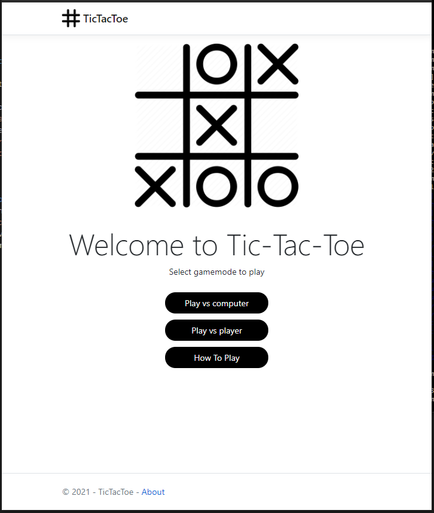
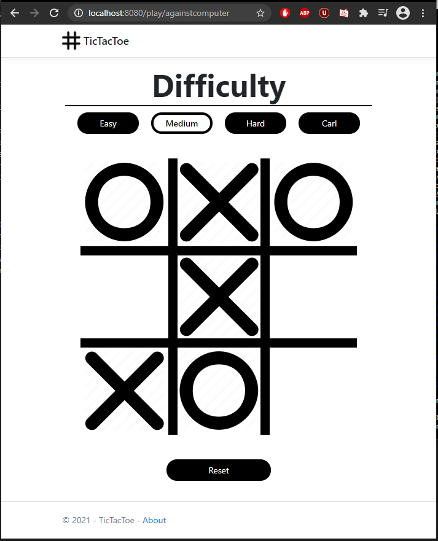
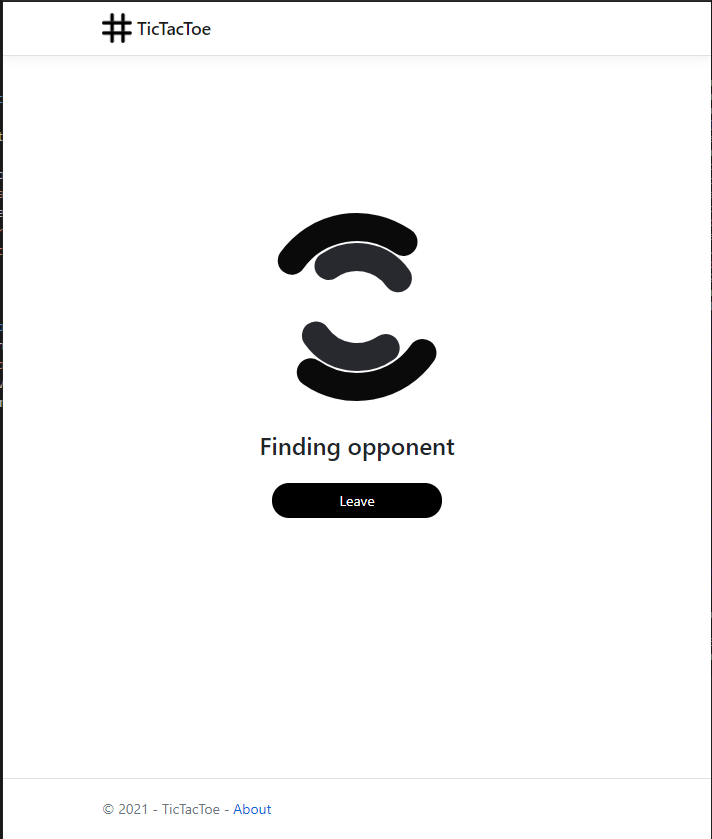
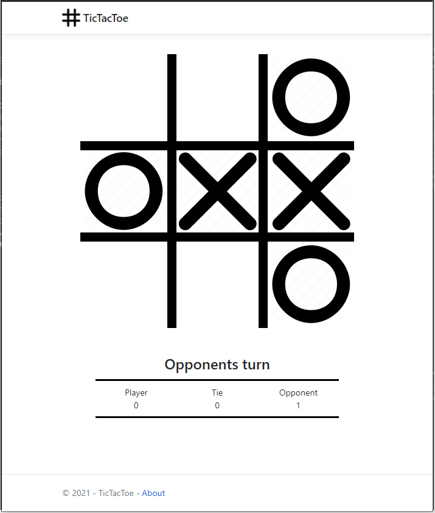
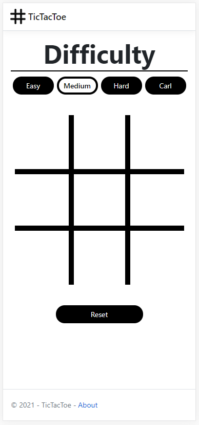

# TicTacToeWeb
A website where you can play Tic-Tac-Toe against the computer or against another player. The computer can be played on different difficulties using the minimax algorithm. 
Player versus player is orchestrated with signalR.

<video width="500" controls>
  <source src="./ReadmePictures/TicTacToeDemo.mp4" type="video/mp4">
  Your browser does not support the video tag.
</video>

 

## Setup
The website can be run in iisexpress directly in visual studio or you can run it as a docker container.

**Run as docker container:**
* Clone the git repository to preferred path, `your/path/`.
* Navigate to `your/path/TicTacToeWeb` in powershell.
* Build the docker image `docker build -t tictactoe:latest .`
* Start a container based on recently built image `docker run -d -p 8080:80 --name tictactoe tictactoe:latest`. This command will start a docker container called tictactoe in the background which can be reached on `localhost:8080`. *Note: You can stop and start the docker container with `docker stop tictactoe` and `docker start tictactoe`.*
* Go to `localhost:8080` and try it out.

## Cleanup

**Cleanup docker container**
* If you want to remove the container and image you first have to stop the container using `docker stop tictactoe`.
* then remove the container using `docker rm tictactoe`.
* lastly remove the image using `docker rmi tictactoe:latest`

## Demo Pictures
Small demo of the pages in this project and their design.

Picture: Homescreen

 
 

Picture: PlayAgainstComputer

 
 

Picture: Matchmaking

 
 

Picture: PlayAgainstPlayer

 
 

Picture: MobileView

